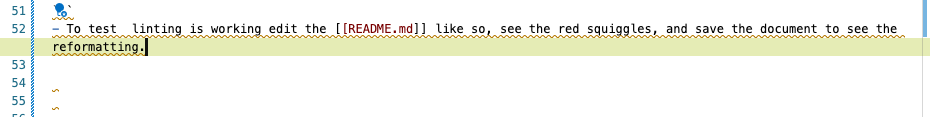

## Dendron Important Files

- [[dendron.yml]] - Customization of Dendron behavior.
- [[dendron.code-workspace]] - Essentially VsCode workspace settings. Includes task, debugger settings, etc.
  - For some reason going to file on `code-workspace` doesn't work, but you can `alt+click` to open. This is the only file I now of that won't open with the wiki link.
- [[dendronrc.yml]] - Allows you arbitrarily link to notes from other workspaces.
- Check [[Extensions|vscode.extensions]] to get an idea of extensions used.

## Dendron Cli

- 🚨 **NOT WORKING**
  - I need to rewrite some of the bash scripts, once these are written, [latex-writing-environment](#latex-writing-environment)
  will make more sense.
    - This is an example of linking within a note
    - Note that regular markdown linking should be used for linking within document. `command palette` → `Trigger Suggest` is useful for this.

- This step is necessary for stitching together [[Paper|Paper]].
  - [Dendron Reference](https://wiki.dendron.so/notes/FnK2ws6w1uaS1YzBUY3BR/).

- Initialize a npm repo at the root of your workspace (where dendron.yml is located)
  - `npm init -y`
- Install dendron-cli
  - `npm install @dendronhq/dendron-cli@latest`

## Markdown Linting

- [Markdown Lint](https://marketplace.visualstudio.com/items?itemName=DavidAnson.vscode-markdownlint) is used to try and keep some consistency within the markdown notes. This pays off big when converting between markdown, pdf, etc. Some of it's setting show up in the [[dendron.code-workspace]].

```json
"markdownlint.config":{
            "MD007": { "indent": 2 },
            "MD008": false,
            "MD013": false,
            "MD014": false,
            "MD018": false,
            "MD025": false,
            "MD026": false,
            "MD033": false,
            "MD045": false,
            "MD050": false,
        },
```

- These codes can be hovered over or searched to find their specification. For example `"MD007"` specifies the unordered list indentation.
- It is preferred to keep formatting up to snuff, by formatting on save. The following setting is used to format on save.

```json
"editor.codeActionsOnSave": {
      "source.fixAll.markdownlint": true,
   },

```

- To test  linting is working edit the [[README.md]] like so, see the red squiggles, and save the document to see the reformatting.

- Before



- After


## Python Package

- This repo is setup for some basic python development. The preferred way to develop is to write an editable package with the intention of eventually publishing to [PyPI](https://pypi.org/project/bumpver/#example-usage).

### Run `__main__.py` from Debugger

- Activate conda environment and make sure that the proper environment is selected for the workspace with [Python Environment Manager](https://marketplace.visualstudio.com/items?itemName=donjayamanne.python-environment-manager) extension.
- Change [[pyproject.toml]] accordingly.
  - It is currently filled with some minimal information. It can be modified as necessary.
- `python -m pip install -e .`
- Open [[src/my_package/__main__.py]].
- `Command Palette` → `Debug: Start Debugging`.
  - Launch settings can be found [[dendron.code-workspace]].
  - You can note that from the published version, the above link is marked as private. This is because the html is referencing an unknown files directory. To overcome this for publishing the url link can be used instead. [src/my_package/__main__.py](https://github.com/Mjvolk3/Dendron-Template/blob/main/src/my_package/__main__.py)

### Error Python Package

- You will get this error if you haven't used [Python Environment Manager](https://marketplace.visualstudio.com/items?itemName=donjayamanne.python-environment-manager) extension or you have `python -m pip install -e .`.

```python
Exception has occurred: ModuleNotFoundError
No module named 'my_package'
  File "/Users/michaelvolk/Documents/projects/Dendron-Template/src/my_package/__main__.py", line 1, in <module>
    from my_package import first_module
ModuleNotFoundError: No module named 'my_package'
```

## VsCode Tasks

- Interactive Tasks: `nano Interactive` and `nano qsub main`.
  - These are intended to show the interactive options of tasks. But they will run as they are. The two examples were used for working with the [Nano Cluster](https://wiki.ncsa.illinois.edu/display/ISL20/Nano+cluster).
- `Pandoc: quick-pdf` does a quick print of a Dendron note. We will walk through its usage.

### Pandoc: quick-pdf

- Install [Pandoc](https://pandoc.org/installing.html), the swiss army knife 🇨🇭🪖🔪 document conversion.
  - Pandoc is how [[Paper|Paper]] in ultimately written to a pdf, docx, latex, etc.
- Open note [[Extensions|vscode.extensions]], and run `Pandoc: quick-pdf`.
  - This command works by referencing the current focused file.
- A terminal output will open.

```bash
 Executing task in folder Dendron-Template: cd ./notes && pandoc -F mermaid-filter -s /Users/michaelvolk/Documents/projects/Dendron-Template/notes/vscode.extensions.md -o /Users/michaelvolk/Documents/projects/Dendron-Template/notes/assets/pdf-output/vscode.extensions.pdf --pdf-engine=xelatex -V geometry:'top=2cm, bottom=1.5cm, left=2cm, right=2cm' --strip-comments  && cd ..
```

- To open the pdf, you can hover over the [[notes/assets/pdf-output/vscode.extensions.pdf]], hold alt and click. You can also navigate to the path to open the file.
- Try to delete this the pdf file and rerun the task, to prove that it works.

## Latex Writing Environment

- Often the Markdown → PDF (via Pandoc) can't get us all of the formatting we need. Markdown → Docx (via Pandoc), or Markdown → latex (via Pandoc) can take us home to the promise land 🌄.
- To illustrate the potential of the latex approach delete  `notes/assets/latex-paper/scribe_template` and unzip [[notes/assets/latex-paper/scribe_template.zip]].
- Go to [[notes/assets/latex-paper/scribe_template/scribe-template.tex]] and run `Command Palette` →  `LaTeX Workshop: Build LaTeX project`. This will produce [[notes/assets/latex-paper/scribe_template/scribe-template.pdf]].

### Potential of Combining Dendron Notes to Latex Paper

- Notes can converted to individual latex documents based on some tex template.
  - 🚨 I haven't done this.

```bash
pandoc input.md -o output.tex -s --template=mytemplate.tex
```

- This can be done in one shot [[Paper|Paper]] to `paper.tex`, or it can be done piecewise by using the import capabilities within latex. For example we could do [[Introduction|paper.Introduction]] to `sections/introduction.tex`, which would then be stitched together in `main.tex`. Below I show a sample hierarchy from a previous overleaf project.


- Naysayer 😈: "Pointless! Why not just write all notes in Latex? This is redundant."
- Evangelist 😇:  "Notes in Dendron allows for searchability, hierarchical notes, and linking of disparate ideas. It's the power of connection! Latex is about the final product 💎."

- If we really wanted we could even write a task, say `paper to latex paper`, that will write all of the necessary latex files for building `main.tex` from Dendron markdown notes. This task would just call a bash script or python script that does this conversion, calling necessary pandoc tools, etc.

## Jupyter Notebooks

- Development in Jupyter Notebooks is discouraged, but it is encouraged to use jupyter for demonstrations, instruction, reports, etc.
- An example of this usage is given here [[notebooks/using-my-package.ipynb]].
- I printed this notebook to a pdf [[notebooks/using-my-package.pdf]] on the notebook page under the triple dot options.
  - This options uses the [Quarto](https://quarto.org/docs/tools/vscode.html) extension by default if installed.
- You can also export to html within Jupyter, see [[notebooks/using-my-package.html]].

## Reproducible Python Environments

- For reproducible python environments, we write the requirements to a `env.yml`. It is worth seeing that the following commands can reproduce the environment.

### Exporting Environment YAML

```bash
conda env export --no-builds | grep -v "prefix" | grep -v "$(pip freeze | grep 'my-package==')\|$(pip freeze | grep 'another-package==')" > env/env-dendron-template.yml
```

- I cannot take credit for the command line wizardry 🧙🏼‍♂️ [[Conversation|chatGPT.conversation.conda-env-yaml-output#conversation]].

### Conda Create from YAML and Install Package

```bash
conda env create -f env/env-dendron-template.yml python=3.11
conda activate env-dendron-template
python -m pip install -e .
```

## Drawio

- Not necessary but another element I like about taking notes with Dendron is using the [Draw.io](https://marketplace.visualstudio.com/items?itemName=hediet.vscode-drawio) extension. This allows making quick graphics that can be updated at any time.

### Drawio Demonstrations

- To make a draw.io image `command palette` → `Draw.io: New Draw.io Diagram`.
- Make a drawing and save the file.
- Within the draw.io gui go to file → convert → png or svg.
- Import the image as you would import any other image. See below.
- If the image is too small once imported into a note you can adjust the size by changing the zoom property. Go to the draw.io gui go to file → properties → zoom.


- This draw.io graphic shows how the [[dendronrc.yml]] is used, and how the workspace is intended to be used in a modular fashion. The important part of this linking is that each workspace is standalone. If an of the links are severed by removing the workspace from the [[dendronrc.yml]], links and note references will go dead, but this should not cause any other part of the workspace to break. The links can be restored by adding the workspace back to [[dendronrc.yml]], and links are traceable if `enableXVaultWikiLink: true` in [[dendron.yml]] . This is the default.


- This is an example of how draw.io using latex equations. There is another feature that I haven't found terribly useful, but it is interesting. You can link draw.io objects to individual code files. This can be done by selecting a draw.io object, opening a code file, and funning `Draw.io: Toggle Code Link Activation`. Then if you open the draw.io image, you can double click that object and it should open the file. This could be useful for charting out different modules and planing. Draw.io also allows for input of data, so graphs can be constructed by data import. There is some interesting ideas here around visualizing code dependencies, note linkages of subgraphs within Dendron, etc.

- Most figures in this [project](https://mjvolk3.github.io/MATH-490-Project/) are made with Draw.io.
